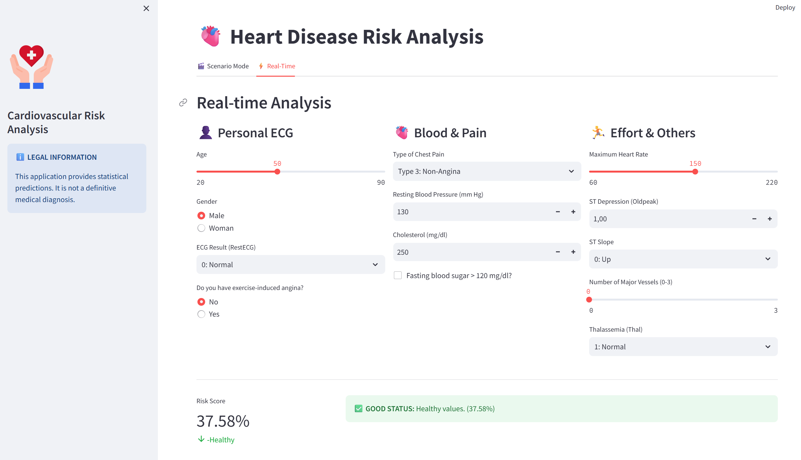

# 🫀 Heart Disease Classification App



> A machine learning–based heart disease risk classification application  
> built using clinical patient data and presented through an interactive user interface.

---

## 📌 Project Overview

This project focuses on predicting **heart disease risk** using supervised **machine learning classification models**.  
Clinical and demographic patient features are used to estimate whether an individual belongs to a **high-risk** or **low-risk** group.

The trained model is integrated into an **interactive application**, allowing users to explore predictions through both real-time inputs and a guided scenario-based flow.

> ⚠️ **Disclaimer:**  
> This application is developed for academic and educational purposes only.  
> It does **not** provide medical diagnosis or clinical advice.

---

## 🎯 Objective

The main objectives of this project are:

- To model a real-world healthcare classification problem
- To apply end-to-end data science workflow:
  - data preprocessing  
  - model training  
  - evaluation  
  - deployment as an application
- To present the project as a **portfolio-ready ML application**

---

## 📊 Dataset

- **Source:** UCI Machine Learning Repository – Heart Disease Dataset  
- **Centers:** Cleveland, Hungarian, Switzerland, Long Beach VA  
- **Task Type:** Binary Classification (Disease / No Disease)

The dataset includes clinical features such as:
- age, sex
- chest pain type
- resting blood pressure
- cholesterol level
- ECG results
- exercise-induced indicators

---

## 🧠 Methodology

### 🔹 Data Preprocessing
- Missing value imputation (median & most frequent)
- Feature scaling
- Stratified train–test split

### 🔹 Machine Learning Models
- Logistic Regression
- Random Forest
- Support Vector Machine (SVM)
- K-Nearest Neighbors (KNN)

### 🔹 Evaluation Metrics
- Accuracy
- Precision, Recall, F1-score
- Confusion Matrix
- ROC Curve
- Feature Importance (tree-based model)

---

## 🏆 Best Performing Model

> **Random Forest Classifier**

- Balanced precision and recall across classes
- Stable performance on unseen data
- Interpretable feature importance

The trained model and preprocessing objects are saved for reuse.

---

## 🖥️ Application Features

The application allows users to interact with the trained model in two modes:

### 🔸 Scenario Mode
- Step-by-step patient data entry
- Loading animation and visual feedback
- Final risk assessment with probability score

### 🔸 Real-Time Mode
- Instant prediction as input values change
- Useful for observing how individual features affect the outcome

---

## 🚀 How to Run

### 1️⃣ Install dependencies
```bash
pip install -r requirements.txt
